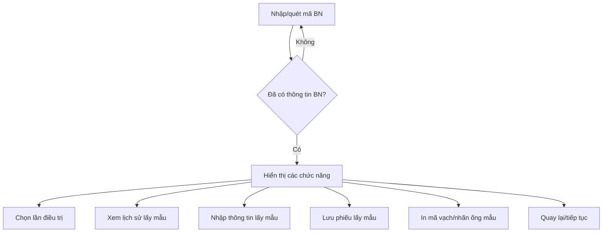

# UI Sketch: Lấy mẫu bệnh phẩm (Bước 3)

## 1. Tổng quan chức năng
- Ghi nhận việc lấy mẫu bệnh phẩm cho bệnh nhân đã có chỉ định xét nghiệm.
- Đảm bảo nhập đủ thông tin mẫu, hỗ trợ in mã vạch, xem lịch sử lấy mẫu.

---

## 2. Luồng hoạt động (cập nhật)
1. Nhập/quét mã BN → Tải thông tin bệnh nhân (bắt buộc thực hiện trước)
2. Sau khi đã có thông tin bệnh nhân, các chức năng sau có thể thao tác độc lập, không phụ thuộc thứ tự:
    - Chọn lần điều trị (nếu có)
    - Xem lịch sử lấy mẫu
    - Nhập thông tin lấy mẫu (ngày giờ, loại mẫu, KTV, vị trí, địa điểm, tình trạng, ghi chú)
    - Lưu phiếu lấy mẫu
    - In mã vạch/nhãn ống mẫu
    - Quay lại danh sách hoặc tiếp tục lấy mẫu cho bệnh nhân khác

---


## 3. Layout đề xuất (cập nhật)

```
+---------------------------------------------------------------+
| [Header] Lấy mẫu bệnh phẩm                                    |
+---------------------------------------------------------------+
| [Tìm bệnh nhân]                                               |
| - Nhập/quét mã BN (input + nút Tìm kiếm/Quét barcode)         |
| - Nếu tìm thấy: hiển thị thông tin bệnh nhân                  |
+---------------------------------------------------------------+
|                                                               |
|  (Chỉ hiển thị các panel bên dưới khi đã có thông tin BN)     |
|                                                               |
| +-------------------+                 +-------------------+   |
| | [Chọn lần điều trị]|                | [Lịch sử lấy mẫu] |   | 
| +-------------------+                 +-------------------+   |
|                                                               |
| +-----------------------------------------------------------+ |
| | [Form nhập thông tin mẫu]                                 | |
| +-----------------------------------------------------------+ |
|                                                               |
| [Nút] Lưu phiếu   [Nút] In mã vạch   [Nút] Quay lại           |
+---------------------------------------------------------------+
```

> Lưu ý: Sau khi nhập/quét mã BN thành công, các panel "Chọn lần điều trị", "Lịch sử lấy mẫu", "Chỉ định cần lấy", "Form nhập thông tin mẫu" và các nút thao tác đều luôn hiển thị đồng thời, thao tác độc lập.

---


## 4. Component đề xuất (React)
- `SampleCollectionPage`
- `PatientInfoCard` (có thể thu gọn, chỉ hiển thị phía trên form)
- `OrderListTable` (nếu cần chọn chỉ định)
- `SampleForm` (form nhập thông tin mẫu, chiếm phần lớn diện tích)
- `SampleCollectionHistoryTable` (bảng lịch sử lấy mẫu, hiển thị bên phải)
- `BarcodePrintDialog`

---

## 5. Sơ đồ luồng (Mermaid - cập nhật)


---

## 6. UX nâng cao
- Tự động focus vào mã BN khi mở form
- Cho phép quét barcode để nhập mã BN
- Hiển thị cảnh báo nếu thiếu thông tin bắt buộc
- Sau khi lưu, tự động chuyển trạng thái “đã lấy mẫu” cho các chỉ định đã chọn
- Cho phép in lại mã vạch nếu cần

---

## 7. Tham khảo bảng dữ liệu liên quan
- `xn_laymau`, `xn_phieu`, `xn_mauthu`, `xn_vitri`, `xn_diadiem`, `xn_tinhtrang`, `xn_dlogin`

---

## 8. Ghi chú
- UI cần responsive, thao tác nhanh, tối ưu cho thao tác barcode và nhập liệu bằng phím.
- Có thể mở rộng thêm popup xác nhận khi in mã vạch hoặc khi lưu thành công.
